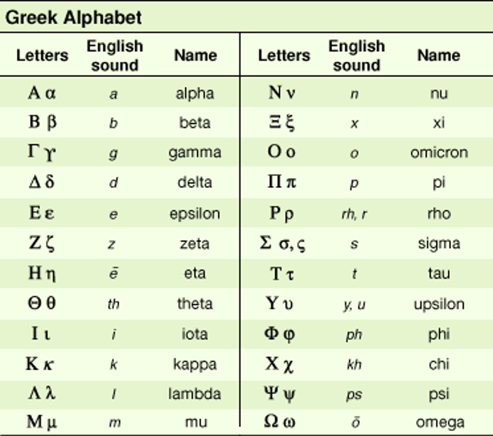
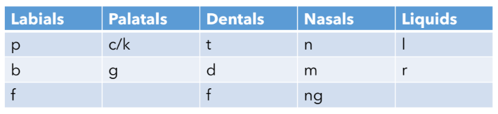

# Lesson 2: How Latin and Greek Work
{: .no_toc}

1. TOC
{:toc}

## Objectives

1. Introduce the Latin and Greek alphabets
2. Discuss transliteration from Greek to English and/or Latin
3. Overview of common language patterns in word formation

{: .warning }
> This page is still under construction. Please check back soon!

## The Greek Alphabet

*The Greek and English alphabets. Image credit: Britannica*

For this class, you are not going to be tested on your ability to memorize the Greek alphabet. In any situation where you might have to read Greek terms in the original language, you will have the alphabet provided as a reference. Depending on your background, you might already be familiar with some of these letters, or the Greek language itself!

Some Greek letters have similar sounds and shapes as their English counterparts:

| Greek letter  | English letter    |
| :---          | :---              |
| Α α           | A a               |
| Β β           | B b               |
| E ε           | E e               |
| Ι ι           | I i               |
| Ζ ζ           | Z z               |
| Κ κ           | K k               |
| Μ μ           | M m               |
| N ν           | N n               |
| O o           | O o               |
| T τ           | T t               |

There are a couple that look tricky-- lowercase nu may be mistaken for a lowercase V, both uppercase and lowercase rho may look like P, uppercase upsilon may look like an uppercase Y, and lowercase omega resembles a lowercase W.

### Transliteration

Transliteration comes from the Latin roots **trans** (across) and **littera** (letter). It's the process of representing the same sounds in different languages. Since many of us don't speak or read Greek, we need a way of representing those roots in an alphabet that's more familiar to us. You can think of transliteration as a cypher or code to switch between one language and another, while still representing the same sounds.

There are a few Greek letters that have interesting patterns in English transliterations. Wherever you see a C or a CH in Greek, those were letters that were originally represented by a kappa (κ) or a chi (χ). So even though those letters make a K or a hard C sound, they will sometimes be represented in English with the letter C. This is because when we transliterate the kappa to English, we can use either a K or a C, since both letters make the same sound in English.

The rho is the letter that looks something like a P. Sometimes in physics it’s used to represent density. Here, it represents the letter R. The Greek R sound is different from the English R sound, though, because the Greek R sounds is *aspirated* (it's a bit of a rolled-R sound). When transliterating rho to English or Latin, sometimes an H is added after the R to indicate that it’s aspirated. This doesn’t happen all the time, but it is something to be on the lookout for. 

You’ll notice that H is not actually part of the Greek alphabet; whenever you see an H in the bases, prefixes, or suffixes, that tells you that there’s actually an aspirated letter. That’s also why the chi is spelled as CH instead of C. It’s a similar sound, but there’s an aspect of breathiness to it.

Finally, let's look at upsilon (υ). This is a funny letter, since it's sometimes transliterated as a Y, as in **hydro** (water) and **hyper** (above, over), but sometimes it's transliterated as a U, as in **neuro** (nerve) Why is that, when they’re the same letter in Greek?

The answer has to do with part of the reason I’m not asking you to memorize or write out letters in the Greek alphabet. Before English became the common language of communication and science, it was Latin. More world languages use the Latin alphabet than the Greek alphabet, so it was easier to read these terms when they were transliterated. There’s an added quirk that many of the Greek words that we use today actually passed through Latin before arriving into English. So some of the spelling quirks are remnants of Latin as well.

## The Latin Alphabet

The Latin alphabet is virtually the same as English, with the following exceptions:

- There is no W
- There is no K (technically, there is, but it's rarely used)
- U and V are the same letter
- I and J are the same letter

### Diphthongs

The Greek word “sphaira” (pronounced “spy-ra”) goes through something similar. When it arrives in Latin, its spelling changes so that Latin speakers still get approximately the same pronunciation as in Greek. The AI diphthong changes to an E, because that’s the vowel in Latin that roughly makes the same sound. However, when we get to English, things change again because we see these letters and we already have pronunciation rules for them. Most notably, the PH sound no longer makes a “p” sound and instead is something closer to “f”.
 
And that has to do with vowel sounds, particularly diphthongs. English has diphthongs, and so does Greek. Diphthongs are groups of two or more vowels that collectively make another vowel sound.

So for example, in English, the word train has the diphthong ai, which makes a long “a” sound. The word house has the diphthong ou, which makes the “ow” sound.

Often, Greek diphthongs either change their vowels or drop them entirely. So for example, the word aisthein, which means “to feel” or “to sense”, has this diphthong which is equivalent to ai. However, when we receive it into English (after an initial pass through Latin), the ai has changed to ae (because that’s how Latin speakers create the same sound). British English often keeps the ae in spellings, but American English will sometimes drop it.
 
In some cases, the vowel drops or is entirely replaced altogether, as in the cases of oikos, meaning “home”, or ouron, meaning “urine”. So to answer the question from earlier, why can you see Y and U in the same word if they’re the same letter in Greek? It’s because wherever you see a U, it’s actually an OU diphthong that dropped its initial O. Pretty neat, right?

## Contraction and Assimilation

Contraction and assimilation are two phenomena that occur in Latin and Greek that explain how and why some spelling patterns occur. Contraction exists in both languages, while assimilation is more exclusive to Latin preposition roots (at least, in this class). Many other world languages experience some degree of these phenomena, including English! 

### Contraction

Contraction happens when one or more letters are omitted from the pronunciation of a word or phrase.

### Assimilation

This time we're going to wrap up the Latin prefixes, and here I want to also give some linguistic justification as to how and why assimilation happens. I think that’ll help you recognize when you have assimilated prefixes and get more comfortable with the forms.

[Linguistics Overview]
So, let’s do some linguistics!

[Some linguistics]
To start out, I've divided up some consonants into these different categories. 

These categories– labials, palatals, dentals, nasals and liquids– are named for the part of your mouth that the sounds more or less originate from. “Labial” is from the Latin word labium, and it’s a base you’ll see in Lesson 34 that means your lips. So p's, b's and f's–when you make those sounds [sounds demonstrated]– they begin near the front of your mouth at your lips. 

Palatals are c, k and g. In Latin, c and k are the same letter, which is why I’ve put them together here. Both of these sounds will start at the roof of your mouth [hard c and g sounds demonstrated], which is called the palate. 

You might recognize the base DENT- in “dentals”, which means that they start at your teeth. These are the consonants t, d, and f. F is a bit of a special case because it does begin at your teeth, but your lips are also involved. So I've put that in both labial and dental. The proper linguistic term is that f is a labio-dental, because it involves both the lips and the teeth, but that distinction isn’t actually super important here. 

The nasals technically begin in your mouth, but they’re called “nasals” because they also involve the nose. So those are the consonants n and m, and the combination ng. 
Finally, there are liquids, which are not actually named after a part of your mouth but because of their more fluid nature, the way they sound. And so those are l's and r's. 

Now, you may have noticed by now that not all the English consonants are represented in this table. For example, the letters s and v are not in this table. That’s because here, I’ve only chosen to show the consonants that tend to assimilate, and assimilation happens when the final consonant of a prefix is in the same family as the first consonant of the following root. 

So all you need to do is check the last consonant of a prefix and see whether it's the same as the first consonant of the following root. You do not need to check for vowels. The assimilation phenomenon usually only happens with consonants. And so the converse of that is that if the final consonant in any of the listed forms in the book does not have the same family as the first consonant of the following root, then the prefix doesn't assimilate. 

There are a couple of extra rules here, is that liquids will assimilate any prefix except the prefix sub-, which is in this lesson, 

and that dentals will assimilate to s. So s is not technically a dental in the sense that it starts at your teeth, but if a dental is followed by the letter s, then it will assimilate to that s. 

I've brought some extra examples here. The first example is the prefix ad- plus the base TEND-. We haven't learned TEND- yet (it’s in Lesson 38), but I thought this would be a good example since the word “attend” might be a familiar word. Now, normally, if you just put the prefix and the base together, you would get “adtend”. But since t and d are both dentals, the ad assimilates to att. And if you try to speak this word out loud, like “adtend”, it almost sounds like the word attend, as we know in English. 

Another example using one of the bases that you do know is the prefix con-, the base RUGA-, and the suffix -ate, which is one of the verb-forming suffixes that we learned back in Lesson 12. So this would have become the word “conrugate” because n and r are in different families. Note, though, that r is a liquid and liquids assimilate everything. This means that con- assimilates to an r and becomes corrugate. 

And finally, an example where assimilation doesn't happen is in the word imprint. So we have the prefix im- being the other form of in- meaning “into”. And then we have the base PRINT-, which we haven't learned yet, but it is also a word in English that means exactly what it looks like. So in this case, m and p are in different families. m is a nasal and p is a labial, but neither of them is a liquid. So imprint just stays as it is. 

A couple of closing remarks. 

First is that whenever the book lists multiple forms, you should take those listed forms of prefixes as their general or their regular forms. So try to be aware of all of those. Memorize what you can. 

And finally, two prefixes that I want to mention specifically are that ab-/a- and ex-/e- are both originally Latin prepositions that occurred in both forms. 

So you'd have ab- or ex- before a vowel, 

and you'd have a- or e- before a consonant. The same rule holds up pretty well in English as well. 

It's like the phenomenon that happens between saying “an apple” and “a banana”. It's the same word, but you add a consonant based on whether or not there's a vowel that follows it. 

You are not responsible for memorizing this consonant chart to say which families are where. You can always come back and refer to this if you're stuck on whether a prefix is assimilated or not. This is just another way to figure out why these prefixes are assimilated and why they look the way they do. 

## Vocabulary list

| Root          | Language of origin    | Meaning                   | Example           |
| :---:         | :---:                 | :---                      | :---              |
| hypn(o)       | Greek                 | sleep                     | hypnosis          |
| cine/kine     | Greek                 | movement                  | kinetic           |
| dynam         | Greek                 | power                     | dynamic           |
| erg           | Greek                 | energy                    | ergonomic         |
| the           | Greek                 | to put, to place          | thesis            |
| path(o)       | Greek                 | feeling, disease          | pathology         |
| hydr(o)       | Greek                 | water                     | hydrant           |
| neur(o)       | Greek                 | nerve                     | neurosis          |
| top(o)        | Greek                 | place, location           | topology          |
| trop          | Greek                 | to turn                   | thermotropism     |
| cata          | Greek                 | against, very, down       | catastrophe       |
| tele          | Greek                 | far, from afar            | telepathy         |
| phon          | Greek                 | sound, voice, speech      | phonics           |
| meta          | Greek                 | with, beyond, after       | metastasize       |
| syn           | Greek                 | together, with            | synthesize        |
| a/an          | Greek                 | not, without              | asexual           |
| anti          | Greek                 | against, opposed to       | antitoxin         |
| somn(i)       | Latin                 | sleep                     | insomnia          |
| scrib/script  | Latin                 | to write, written         | prescribe         |
| sens/sent     | Latin                 | to feel, to perceive      | sentient          |
| corp          | Latin                 | body                      | corporeal         |
| mar           | Latin                 | ocean                     | marine            |
| cal(or)       | Latin                 | heat                      | calorie           |
| fac(t)/fec(t) | Latin                 | to make                   | factory           |
| e/ex          | Latin                 | out of, outside, former   | expel             |
| inter         | Latin                 | between                   | international     |
| intra         | Latin                 | within                    | intramural        |
| de            | Latin                 | down from, out of         | deduce            |
| circu(m)      | Latin                 | around                    | circumscribe      |
| ad*           | Latin                 | to, towards               | advance           |
| sub*          | Latin                 | beneath, below, under     | substitute        |
| con/com*      | Latin                 | with                      | concur            |
| in*           | Latin                 | into, inside, on          | include           |
| in*           | Latin                 | not, without              | include           |
| ob*           | Latin                 | against, facing           | obtuse            |

## Vocabulary practice

**Practice Set A.** Use the Greek-English alphabet provided to transliterate each of the following Greek words to English. Then, using your knowledge of the roots, tell what each word means.

1. υπνος
2. παθος
3. υπερ
4. γραφη
5. πολυ
6. λογος
7. κατα
8. φωνη
9. συν
10. υδρος

**Practice Set B.** Identify the roots in each of the following words, give their language of origin, and their definitions. Some words will have more than one root from the lesson's vocabulary!

1. circumference
2. subscription
3. synesthesia
4. teleport
5. calorifacient
6. interfere
7. energy
8. offer
9. topography
10. inscribe
11. neuropathology
12. metamorphosis
13. incorporeal
14. sensation
15. cinematic

## Reflection Questions

1. What was your experience with the Greek alphabet like before this lesson? In what contexts have you seen Greek letters or words in the original alphabet?
2. What language(s) are you familiar with? Do those languages experience any contraction or assimilation? Give examples.
3. Choose any three preposition roots from this lesson and give three examples each, of words you know that don't appear in this lesson but use those roots. (A total of 9 words, with their definitions)
4. Choose any three Greek roots from the vocabulary you know so far and try transliterating them back to Greek (don't use words that were used in Practice Set A!).