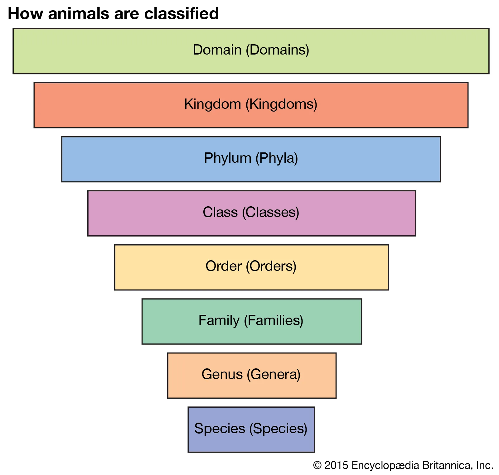

# Lesson 4: Taxonomy

## Objectives

1. Learn about the history of taxonomy and its uses in biological classification
2. Discover the role of Greek and Latin terms in rank-based taxonomy

## Introduction to Taxonomy

***Taxonomy*** comes from the Greek words *taxis* (ordering, arrangement) and *nomia* (law, method). Simply put, a taxonomy is a method of ordering or arranging a collection of items. You may have heard of Bloom's taxonomy, which is a system for categorizing educational goals. Maslow's hierarchy of needs categorizes human needs at a physical and psychological level. The taxonomy of programming languages sorts different programming languages according to syntax, function, or use (though you'd be hard-pressed to find one universal taxonomy).

In biology, however, *taxonomy* takes on a specific meaning. Taxonomy refers to the specific method of classifying and naming living organisms. The modern taxonomical system uses a **rank-order system**, which organizes living organisms in a hierarchical structure. Each level of the hierarchy is called a **rank**.

*The rank-order system. (Image credit: Encyclopedia Britannica)*

The **rank-order system** of taxonomy organizes living organisms into a hierarchical structure, facilitating a clear understanding of their relationships and classifications. This system consists of several ranks, each representing a different level of biological classification. The primary ranks include domain, kingdom, phylum, class, order, family, genus, and species. Each rank groups organisms based on shared characteristics, with higher ranks encompassing broader categories and lower ranks being more specific. 

Let's look at the classification of the gray wolf (canis lupus):

- Domain (Eukarya), 
- Kingdom (Animalia), 
- Phylum (Chordata), 
- Class (Mammalia), 
- Order (Carnivora), 
- Family (Canidae), 
- Genus (Canis),  
- Species (Canis lupus).

*A gray wolf. Image credit: Encyclopedia Britannica*

At the top of this hierarchy is the **domain**, which represents the broadest category. Within each domain, organisms are further divided into **kingdoms** based on more specific shared traits. For example, the kingdom *Animalia* includes all animals, while the kingdom *Plantae* encompasses plants. The next level, the **phylum**, describes a specific physical characteristic shared among all members of that phylum. For example, *Chordata* (which comes from the Greek word for "backbone") includes all vertebrates&mdash; that is, animals with backbones.

As you move down the ranks, each level becomes increasingly specific, allowing for a hierarchical classification of organisms that share similar traits. This structured approach enables scientists to identify and study organisms systematically, fostering a better understanding of their evolutionary relationships.

{: .note}
> In fact, the word *specific* originally was used to mean "pertaining to members of the same type"

Each rank also serves as a way to communicate important biological information. For example, the **family** rank groups organisms that share more specific characteristics, such as behavioral traits or genetic similarities. In the case of the gray wolf, being part of the *Canidae* family indicates its close relationship with other canids, like domestic dogs and foxes. The **genus** rank further narrows down the classification, indicating a close-knit group of species that share a recent common ancestor. Finally, the **species** rank identifies individual organisms that can interbreed and produce fertile offspring, forming the fundamental unit of biological classification.

## Latin and Greek in Scientific Naming

Greek and Latin play a crucial role in taxonomy, the science of naming and classifying organisms. This dual-language foundation stems from the historical influence of Greek philosophers and Roman scholars in early scientific discourse. Latin, as the language of scholarship and science during the Renaissance, became the primary medium for formalizing species names. In our gray wolf example, the genus *canis* comes from the Latin word for "dog", and the species *lupus* is the Latin word for "wolf".

Greek, on the other hand, contributes to many of the root words used to describe characteristics of organisms. For example, the megalodon, a prehistoric species of shark, takes its name from the Greek words *megalos* (large) and *odon* (tooth).

{: .note}
> The full scientific name of the megalodon is the *Otodus megalodon*. "Otodus" comes from the Greek words *otos* (ear) and *odon* (tooth). Sometimes, the same root will appear more than once in one scientific name.

## The History of Taxonomy

### The Aristotelian System

    

        
Though the practice of naming, classifying, and identifying plant and animal species was vital to the development of early civilizations (as it was important to know which plants were edible, medicinal, and poisonous), the first widely-used system of classification in the West came from the Greek philosopher <b>Aristotle</b>. In the 4th century BCE, Aristotle introduced a hierarchical classification system based on shared characteristics among living beings. He divided organisms into two main categories: plants and animals, further subdividing them based on observable traits such as habitat and physical attributes.

    

    

        
        <figcaption style="text-align: left; margin-top: 5px;"><i>A bust of Aristotle. Image credit: Wikipedia</i></figcaption>
    

However, Aristotle's system had its flaws. Since microscopes would not be invented until nearly two millennia later, Aristotle's system does not include microscopic organisms, such as plankton, amoeba, bacteria, or protists. Further, his method of rationalizing about plants and animals was quite different from how modern biologists might use DNA sequencing or empirical research to determine how species are related to one another. As such, some of Aristotle's classifications turned out to be misguided or straight-out wrong.

For example, one of the distinguishing characteristics for dividing animal categories was whether or not the animal had blood. (We know now that all animals have blood). Aristotle called "blooded" animals *Enhaima*, and "non-blooded" animals *Anhaima*. Some examples of *Enhaima* included humans, cats, dolphins, snakes, and sharks. Some examples of *Anhaima* included shrimps, squids, insects, and worms.

{: .note}
> Though Aristotle was misguided in the idea of distinguishing whether animals had blood or not, the *Enhaima* and *Anhaima* categories broadly map onto the modern biologist's *vertebrates* and *invertebrates*.

### Revival in the Renaissance

During the Middle Ages, the study of taxonomy stagnated in Europe as classical texts were largely overlooked. However, Islamic scholars preserved and expanded upon Aristotle's work, developing more sophisticated classifications that included additional criteria. These scholars contributed to the cataloging of medicinal plants and animals, emphasizing practical applications in botany and medicine. This period also saw the compilation of herbals, which were essential texts that categorized plants based on their uses rather than strictly their biological characteristics.

The Renaissance marked a renewed interest in nature and science, leading to significant advancements in taxonomy. The invention of the printing press allowed for the widespread distribution of scientific texts, facilitating the sharing of knowledge among scholars.

### Joseph Pitton de Tournefort

    

        
The work of French naturalist and botanist <b>Joseph Pitton de Tournefort</b> in the late 17th century also played a pivotal role in taxonomy. Tournefort is best known for his classification of plants, which he organized based on their floral structures. His system focused on the physical characteristics of plants, rather than a strict hierarchical system. Tournefort's influence was significant, as he established the concept of a <i>genus</i>, which later taxonomies adopted and expanded upon. His classifications emphasized the importance of morphology in understanding plant relationships, paving the way for more systematic botanical studies.

    

    

        
        <figcaption style="text-align: left; margin-top: 5px;"><i>Joseph Pitton de Tournefort. Image credit: Wikipedia</i></figcaption>
    

### John Ray

    

        
One of Tournefort's contemporaries was the English naturalist and botanist John Ray. Ray was heavily influenced by the Aristotelian system of taxonomy but gradually grew to reject it. Like Tournefort, Ray worked primarily with plants, and he established the definition of a <i>species</i>, which essentially were organisms that derived from like organisms. In other words, plants that came from the same seeds were of the same species.

    

    

        
        <figcaption style="text-align: left; margin-top: 5px;"><i>John Ray. Image credit: Wikipedia</i></figcaption>
    

## Carl Linnaeus (and his contemporaries)

    

        
Much of the contemporary taxonomic system owes greatly to Carl Linnaeus, an 18th-century Swedish naturalist and botanist. Linnaeus introduced a binomial nomenclature system in the 18th century, which revolutionized taxonomy by providing a standardized method for naming species. Each organism was assigned a two-part Latin name, consisting of the genus and species. This system not only brought clarity and consistency to naming practices but also facilitated communication among scientists worldwide. Linnaeus’s works, particularly *Systema Naturae*, systematically classified thousands of species, providing a framework that is still in use today.

    

    

        
        <figcaption style="text-align: left; margin-top: 5px;"><i>Portrait of Carl Linnaeus by Alexander Roslin. Image credit: Wikipedia</i></figcaption>
    

Linnaeus emphasized observable characteristics, grouping organisms based on physical traits such as flower structure in plants and anatomical features in animals. In particular, he did away with the floral structure of Tournefort's system, since he recognized that not all plants produce flowers. Instead, Linnaeus categorized his plants based on their reproductive characteristics (a move that earned him a controversial reputation among his contemporaries).

This empirical approach allowed for a clearer understanding of the relationships among species and laid the groundwork for further advancements in biological classification. While he used the rank-order system in almost the same way that we use it today, he created a shorthand for cataloguing different species.

Linnaeus was a popular and celebrated figure in his own time, and he amassed several students which he called his "apostles". Among these were Peter Kalm, Pehr Löfling, Daniel Rolander, Daniel Solander, and Carl Peter Thunberg. Linnaeus instructed these apostles to go out on expeditions into different parts of the world to record and send samples of the species they encountered there. Unfortunately, many died on the expeditions, and Linnaeus took to naming other organisms in their honor (Kalmia, Loeflingia, Rolandra, Solandra, and Thunbergia, respectively). Though some of Linnaeus's names have been changed in the modern day, many of them carry the *L.* prefix in front of them to honor the system they originally came from.

{: .note}
> Linnaeus was fond of naming organisms after mythological figures or people he knew. One of Linnaeus's close friends from university was Peter Artedi, the "father of ichthyology". While in school, the two friends had discovered a common interest in the natural world and classifications. They vowed to embark on a shared quest to name and classify all the world's species. However, Artedi's untimely death at the age of 30 meant that Linnaeus had to continue most of the work alone. Later, he would name a flower for his friend, the *Artedia squamata*.

## Vocabulary list

| Root          | Language of origin    | Meaning                   | Example           |
| :---:         | :---:                 | :---                      | :---              |

## Vocabulary practice

**Practice Set A.**

**Practice Set B.**

## Reflection Questions

1. What do each of the words in the full rank-order classification for the gray wolf mean? You may have to look some of them up. Look for specific etymologies.
2. Most taxonomical systems from ancient times to the Enlightenment based classifications on an organism's physical characteristics. What is one advantage of this? What is one shortcoming of this? Explain your answers.
3. Think back to the way that names can be Latinized or un-Latinized in Lesson 3. How did Linnaeus Latinize his friends' and students' names when naming genera after them?
4. Linnaeus had a penchant for giving organisms the names of people he knew. What might be one problem with this, and why? Think about the purpose of the rank-order classifications and what each rank is meant to represent.
