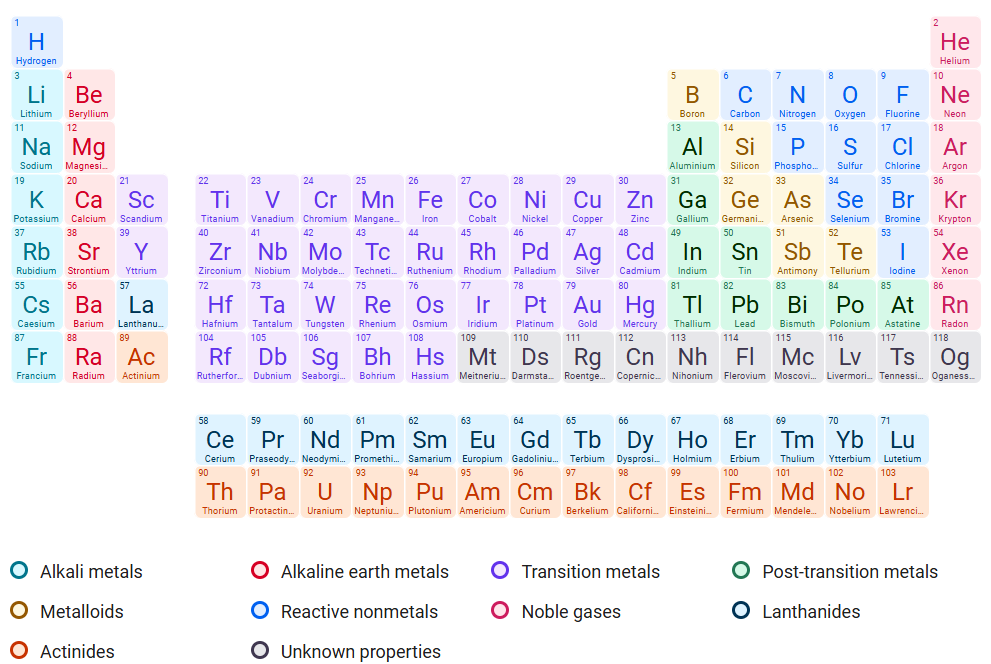

# Lesson 8: Names in Chemistry
{: .no_toc}

1. TOC
{:toc}

## Objectives

1. Review endings and introduce diminutives
2. Learn about specific naming usages in chemistry

## Diminutives

Simply put, a **diminutive** is an ending that indicates that something is smaller or of a lesser degree. Usually, these will translate to "little".

English is one of the unfortunate languages that does not really have a lot of diminutives outside of names. One example might be changing “dog” to “doggy” to indicate that it's smaller. With names, diminutives in English take on a form of endearment or nicknaming, such as calling a person named Timothy “Timmy” instead.

The force of the diminutive is sometimes better felt in other languages. Note the following examples:

- *Maison* means “house” in French, and a *maisonette* is a “little house”. The diminutive here is the ending *-ette*.
- *Cod* means “bag” in Welsh, and a *coden* is a “small bag”. The diminutive here is the ending *-en*.
- *So* (소) means “cow” in Korean, and a *song’aji* (송아지) is a “little cow”, or a calf. THe diminutive here is the ending *ng'aji* (ㅇ아지).

{: .note}
> This idea of diminutives meaning “smaller” isn’t really something that we have in English, but it is something that carries through in other modern languages. You might even know other examples, if you're familiar with other languages!

As far as bioscientific vocabulary goes, when you add a root and a diminutive, you get a word that basically means "little <base\>". This is a pretty standard formula:

- **bacter** (rod) + *-ium* = bacterium (little rod)
- **aster** (star) + *-isk* = asterisk (little star)
- **coni** (dust) + *-idium* = conidium (little dust)

{: .note}
> All diminutives are noun-forming endings.
 
The following is a list of all diminutives, along with which language they are derived from. 

{: .note}
> **Why are all these diminutives spelled differently if they mean the same thing?**\n
Unfortunately, the inventors of Ancient Greek did not have the speakers of Modern English in mind when these diminutives were originally in use. Since both Greek and Latin are inflected languages, the formation of diminutives changes depending on the type of noun or adjective that the diminutive derives from. Anglicization is also at fault for why some diminutives look like other noun-forming endings. 

## Chemistry Crash Course

To understand how Greek and Latin roots and endings are used in chemical sciences, it's important to understand a few key concepts.

### Elements

Elements are the fundamental building blocks of matter, each consisting of atoms that share the same number of protons in their nuclei. The periodic table categorizes these elements based on their properties and atomic structure. The names of many elements are derived from Latin and Greek, reflecting their historical discovery and the etymology of their characteristics. For example, "Hydrogen" comes from the Greek roots "hydro" (water) and "gen" (creation), signifying its role in forming water when it combines with oxygen.

Each element has a unique symbol, often a one- or two-letter abbreviation. The symbols often derive from their Latin names, such as "Na" for sodium (from "Natrium") and "Fe" for iron (from "Ferrum"). Understanding these roots not only helps in memorizing the elements but also provides insight into their properties and uses. For instance, elements like "Chlorine" (from the Greek "chloros," meaning green) highlight the visual aspects associated with certain chemical properties.

Elements can be classified into metals, nonmetals, and metalloids, each group exhibiting distinct characteristics. Metals tend to conduct electricity and heat well, while nonmetals have varied properties, often serving as insulators. Metalloids exhibit intermediate properties, bridging the gap between metals and nonmetals. This classification is essential for understanding how elements will interact with one another in various chemical reactions.

*The periodic table, for your reference. We'll revisit the periodic table in Lesson 10! (Image credit: Google)*

### Atoms and Atomic structure

Three subatomic particles make up an atom: the positively-charged proton, the negatively-charged electron, and the neutrally-charged (or uncharged) neutron. Protons and neutrons comprise the **nucleus** at the center of an atom. The number of protons in the nucleus defines the atomic number and, consequently, the identity of the element. For instance, carbon has six protons, making it carbon regardless of the number of neutrons or electrons present.

*A diagram of a carbon atom. Not all protons and neutrons are shown in the nucleus. (Image credit: Universe Today)*

Electrons, which are negatively charged, orbit the nucleus in specific energy levels or shells. The arrangement of these electrons determines an atom's chemical properties and its ability to form bonds with other atoms. Atoms with similar **electron configurations** often exhibit similar chemical properties, a principle that helps categorize elements in the periodic table. The different colors in the periodic table shown above indicate different **families**, which share chemical properties.

### Valence Electrons

Valence electrons are the outermost electrons of an atom and play a critical role in chemical bonding and reactivity. The number of valence electrons determines how an atom will bond with others to achieve stability, often through the octet rule, which states that atoms prefer to have eight electrons in their valence shell. This desire for a full outer shell drives the formation of various chemical bonds, including ionic and covalent bonds.

The concept of valence is deeply rooted in the language of chemistry. The term "valence" itself comes from the Latin "valentia," meaning strength or capacity. This reflects the ability of an atom to bond with others, showcasing the capacity of elements to combine and form compounds. For example, sodium (with one valence electron) readily loses that electron to achieve stability, while chlorine (with seven valence electrons) gains an electron to complete its octet, leading to the formation of sodium chloride (table salt).

Different groups of elements on the periodic table have distinct valence electron configurations. For example, the alkali metals in Group 1 have one valence electron, while the noble gases in Group 18 have a full valence shell. This systematic arrangement helps predict chemical behavior and reactivity, which is essential for understanding how substances interact in chemical reactions.

### Bonds

Bonds are the forces that hold atoms together in compounds, and understanding the different types of bonds is crucial for studying chemistry. The primary types of bonds include ionic, covalent, and metallic bonds. Ionic bonds form when electrons are transferred from one atom to another, resulting in oppositely charged ions that attract each other. This type of bonding is commonly observed between metals and nonmetals, such as in sodium chloride, where sodium donates an electron to chlorine.

Covalent bonds, on the other hand, involve the sharing of electrons between atoms. This type of bond is typically found between nonmetals, where atoms share one or more pairs of electrons to achieve stability. The strength of a covalent bond is often determined by the number of shared electron pairs, with double and triple bonds being stronger than single bonds. The terminology surrounding covalent bonds often comes from Latin; for example, "co-" means "together," indicating the shared nature of these bonds.

Metallic bonds differ significantly from ionic and covalent bonds. In metallic bonding, electrons are not associated with individual atoms but instead form a "sea of electrons" that are free to move throughout the metallic structure. This delocalization of electrons accounts for many properties of metals, such as conductivity and malleability. Understanding these different types of bonds and their characteristics is essential for predicting how substances will behave in chemical reactions and in different states of matter.

### Oxidation

Oxidation is a chemical process that involves the loss of electrons by an atom or ion, often resulting in an increase in oxidation state. The term "oxidation" originally referred to reactions with oxygen, but it has since broadened to encompass a variety of electron transfer processes. The language of oxidation is heavily influenced by Latin; "oxido" means to combine with oxygen, and this historical context helps explain the evolution of the term.

In redox (reduction-oxidation) reactions, oxidation is always accompanied by reduction, where another atom gains the electrons that have been lost. This simultaneous process is vital in many biological and industrial processes, such as cellular respiration and combustion. Understanding oxidation states helps chemists predict the products of these reactions, as elements will often change their oxidation states to achieve greater stability.

The concept of oxidation is also linked to the concept of corrosion, which occurs when metals react with environmental elements, leading to deterioration. For instance, the rusting of iron is a classic example of oxidation, where iron reacts with oxygen in the presence of moisture. The implications of oxidation are far-reaching, affecting not only material science but also environmental science and energy production.

## Chemical Endings

Chemical nomenclature relies heavily on specific endings to indicate the types of compounds being formed, and understanding these endings is crucial for effective communication in chemistry. One of the most common endings is "-ide," which is used for simple binary compounds. For example, in sodium chloride (NaCl), the "-ide" suffix indicates that the compound consists of sodium and chlorine, a metal and a nonmetal, respectively. This naming convention helps distinguish between different types of compounds, especially when dealing with similar elements.

Another important suffix is "-ate" or "-ite," which are used for polyatomic ions. The "-ate" suffix usually denotes a compound containing a higher number of oxygen atoms, while "-ite" indicates a compound with fewer oxygen atoms. For example, sulfate (SO₄²⁻) has more oxygen atoms than sulfite (SO₃²⁻). This differentiation is particularly vital in understanding the properties and reactions of these ions in various chemical contexts, from biological processes to industrial applications.

In organic chemistry, the endings can also indicate the functional groups present in molecules. For instance, "-ol" signifies alcohols, "-al" denotes aldehydes, and "-one" represents ketones. These endings inform chemists about the chemical behavior and reactivity of the substances in question. By mastering these conventions, chemists can easily identify and predict the properties of compounds based on their names.

The systematic use of these chemical endings ensures clarity in scientific communication, helping prevent misunderstandings. This is especially important in fields such as pharmacology, where precise naming can influence the effectiveness and safety of drugs. Overall, a strong grasp of chemical endings is fundamental for anyone studying or working in the chemical sciences.

## Roman Numerals in Chemistry

Roman numerals play a significant role in chemical nomenclature, particularly when naming transition metal compounds that can exhibit multiple oxidation states. In such cases, Roman numerals indicate the specific charge of the metal ion in a compound. For instance, iron can exist in both a +2 and a +3 oxidation state, represented as iron(II) for Fe²⁺ and iron(III) for Fe³⁺. This system helps clarify which ionic form of the metal is present, preventing confusion that could arise from the use of common names alone.

The use of Roman numerals is essential when dealing with complex coordination compounds and inorganic chemistry. For example, in copper(II) sulfate (CuSO₄), the Roman numeral II indicates that copper is in the +2 oxidation state. Similarly, in manganese(IV) oxide (MnO₂), the IV indicates that manganese has a +4 oxidation state. This practice is especially useful in distinguishing between compounds that might otherwise have similar names, thus aiding in accurate communication among chemists.

The tradition of using Roman numerals dates back to classical chemistry and has been widely adopted to enhance clarity in naming. This is particularly important in educational settings, where students are introduced to various compounds and must learn how to interpret names correctly. The system not only emphasizes the importance of oxidation states but also reinforces the relationship between charge and chemical behavior.

Overall, the incorporation of Roman numerals into chemical nomenclature serves as a practical tool for chemists, ensuring that they can accurately convey information about the identity and properties of compounds. As students and professionals become more familiar with this system, they enhance their ability to navigate the complexities of chemical interactions and reactivity.

## Chemical Notation

Chemical notation is a symbolic language used to represent chemical substances, their compositions, and the reactions between them. This notation includes chemical formulas, equations, and symbols that convey vital information about the elements and compounds involved. For instance, the chemical formula for water is written as H₂O, indicating that each molecule consists of two hydrogen atoms bonded to one oxygen atom. Such formulas provide a concise way to represent the composition of substances, which is essential for both communication and calculations in chemistry.

One important aspect of chemical notation is the use of subscripts and superscripts. Subscripts indicate the number of atoms of an element in a molecule; for example, in CO₂, the subscript "2" shows that there are two oxygen atoms for every carbon atom. Superscripts are used to denote the charge of ions, such as in Na⁺, where the plus sign indicates that sodium has lost one electron and carries a positive charge. Understanding how to interpret these notations is crucial for anyone working with chemical equations or studying reactions.

Chemical equations represent chemical reactions, showing the reactants on the left side and the products on the right. For example, the reaction of hydrogen and oxygen to form water can be written as 2H₂ + O₂ → 2H₂O. This notation not only conveys the substances involved but also allows chemists to balance the equation, ensuring that the law of conservation of mass is upheld. The coefficients in front of the chemical formulas indicate the relative amounts of each substance participating in the reaction.

Moreover, chemical notation also incorporates symbols for various states of matter, such as (s) for solid, (l) for liquid, (g) for gas, and (aq) for aqueous solutions. This additional information helps convey the conditions under which a reaction occurs, making the notation even more informative. Mastery of chemical notation is fundamental for anyone studying chemistry, as it lays the groundwork for understanding more complex concepts and interactions within the field.

## Vocabulary List

| Root          | Language of origin    | Meaning                   | Example           |
| :---:         | :---:                 | :---                      | :---              |

## Vocabulary Practice

**Practice Set A:**

## Reflection Questions

1. What diminutives are you familiar with, in English or in any other language you know?
2. Choose any 3 of the roots from the Lesson 8 vocabulary list and attach any diminutive ending to them to create a new term. Then, interpret what your term means. Is it one that exists already? (You may look up definitions for this question)
3. What chemistry concepts were you familiar with prior to reading this lesson? What was unfamiliar?
